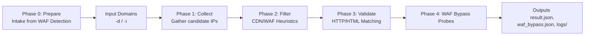
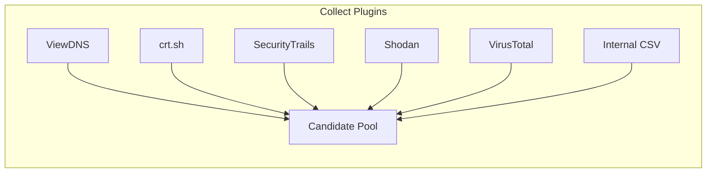
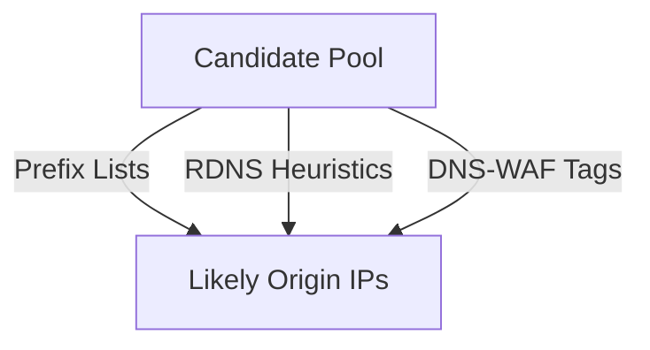
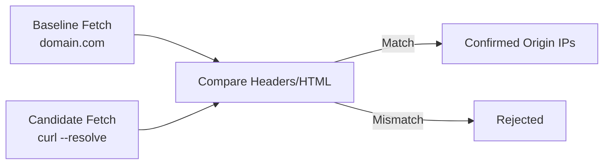
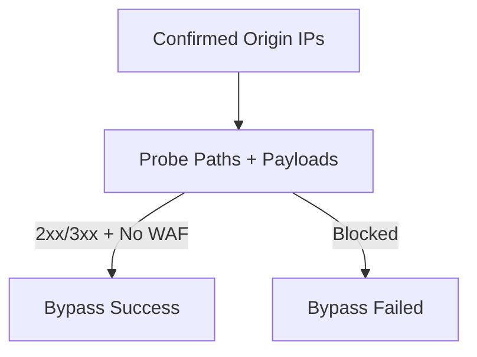

# Real IP Detection (Origin-IP Hunter)

A comprehensive toolkit to detect **origin IP addresses** hidden behind CDN/WAF providers (Cloudflare, Akamai, AWS CloudFront, Fastly, Azure Front Door, etc.).

Designed for **Attack Surface Management (ASM)** and **Internet Perimeter workflows** (e.g., NAB operations, Kali + AWS EC2 runners). The system supports multi‑phase **prepare → discovery → validation → WAF‑bypass probing** with structured outputs and per‑domain logs.

---

## 🚀 Key Features

* **Phase 0 – Prepare**: ingest weekly **WAF‑detected domains**, clean & dedupe, scope‑filter, and produce a ready‑to‑scan list.
* **Multi‑source IP collection** (ViewDNS, crt.sh, Shodan, VirusTotal, SecurityTrails, internal DNS data).
* **Automated filtering** of CDN/WAF ranges via prefix lists + RDNS heuristics.
* **Direct validation** with forced `curl --resolve` requests and content similarity checks.
* **WAF bypass probes** with controlled payloads (LFI, SQLi, XSS).
* **Structured outputs** in JSON (`result.json`, `waf_bypass.json`) with per‑domain logs.
* Ready for automation via **AWS EC2** runner scripts.

---

## 🏗️ System Architecture (Pipeline View)


👉 The pipeline flows **prepare → collection → filtering → validation → probing → outputs**.

---

## 🔄 Workflow: The 5 Phases

### 🔸 Phase 0 – Prepare (Domain Intake from WAF Detection)

**Goal:** Produce a clean, scoped list of domains previously flagged as **behind WAF** by the weekly WAF‑Detection pipeline, to be used as input for this tool.

**Inputs (examples):** WAF‑detection exports such as CSV/JSON/TXT (e.g., `weekly_http_waf_list.csv`, `waf_detection_result.json`, `url_list.txt`).

**Filtering & normalization:**
- Normalize hosts (strip scheme/path/port, lowercase, unbracket IPv6, drop trailing dot).
- Exclude IP literals (IPv4/IPv6).
- Remove non‑routable/internal TLDs (`.local`, `.corp`, `.lan`, `localhost`, `arpa`, `invalid`, `test`, `example`, …).
- (Optional) **Scope filter** (e.g., keep only `*.nab.com.au`, `*.nab.com`).
- Dedupe while preserving subdomains.

**Output:** A single file (e.g., `domain/prepared.txt`) with one domain per line — this becomes the input for Phase 1 (Collect) or can be passed directly via `-i`.

---

### 🔹 Phase 1 – Collect (Candidate IP Gathering)

**Goal:** Build the widest possible pool of candidate IPs linked to the target domain.

**How it works:**
- Collect from plugins: ViewDNS, crt.sh, SecurityTrails, Shodan, VirusTotal, internal CSVs.
- Each plugin runs independently; errors don’t stop the pipeline.

**Pros:** Wide coverage, includes historical data, resilient to API failures.  
**Cons:** Many false positives (CDN/WAF edges, outdated IPs), free‑tier quota limits.  
**Output:** Broad, noisy pool of candidate IPs.



---

### 🔹 Phase 2 – Filter (CDN/WAF Heuristics)

**Goal:** Remove CDN/WAF edge IPs and keep only likely backend servers.

**How it works:**
- Apply prefix lists for known providers (Akamai, Cloudflare, CloudFront, Fastly, GFE, Azure).
- Use RDNS heuristics (`edgesuite.net`, `cloudflare.net`, `incapdns.net`). 
- Drop candidates flagged as `WAF:<vendor>`.

**Pros:** Greatly reduces noise, strong precision.  
**Cons:** Can be too strict (possible false negatives if vendor IPs change). Requires weekly prefix list updates.  
**Output:** Smaller, refined candidate IP list.



---

### 🔹 Phase 3 – Validation (HTTP/HTML Matching)

**Goal:** Confirm which candidate IPs truly serve the protected domain.

**How it works:**
- Perform baseline fetch from domain (`https://domain/`).
- Perform forced fetch with `curl --resolve "domain:443:IP"`.
- Reject if headers expose CDN/WAF fields (`cf-ray`, `akamai`, `incapsula`). 
- Compare HTML content (title, head/tail) using similarity scoring.
- Retry with relaxed thresholds for dynamic sites.

**Pros:** Provides concrete evidence of origin servers, reduces guesswork.  
**Cons:** Dynamic sites may cause false negatives; thresholds must be tuned.  
**Output:** Confirmed origin IPs in `result.json`.



---

### 🔹 Phase 4 – WAF Bypass Probes

**Goal:** Detect if confirmed backend IPs are directly reachable and exploitable without WAF protection.

**How it works:**
- Probe validated IPs over `http/https` with lightweight payloads (LFI, SQLi, XSS).
- Success = HTTP `2xx/3xx` with **no WAF signatures** in headers/body.
- Failure = 403/503 or known WAF blockpages.

**Pros:** Exposes real attack surface, directly actionable.  
**Cons:** Payload set is lightweight (not full exploitation). WAF vendors update rules frequently.  
**Output:** High‑risk backend IPs written into `waf_bypass.json`.



---

## 📂 Folder Structure

```
real_ip_detection/
├─ origin_ip_hunter.py              # Orchestrator (Phase 1→4)
├─ config.py                        # API keys (local only)
├─ requirements.txt
├─ domain                           # Domain list & prepared.txt
│  └─ prepared.txt                  # Output of Phase 0 (one domain per line)
├─ data/
│  └─ waf_detection/                # Weekly WAF-detection outputs (inputs for Phase 0)
│     ├─ waf_detection_result.json
│     └─ weekly_http_waf_list.csv
├─ dns_propagation_results.json     # ViewDNS plugin data
├─ dns_results_with_spf_dmarc.csv   # Internal DNS/IP CSV
├─ modules/
│  ├─ prepare_phase.py              # Phase 0 implementation
│  ├─ http_probe.py                 # GET with Host header
│  ├─ multi_port_probe.py           # Probe multiple ports
│  ├─ content_compare.py            # HTML comparison
│  ├─ similarity.py                 # difflib similarity
│  ├─ phase3_httpx_check.py         # Validation logic
│  └─ phase4_probe.py               # WAF bypass probes
├─ plugins/
│  ├─ viewdns_ip_collector.py
│  ├─ subdomain_ip_collector.py
│  ├─ crtsh_ip_collector.py
│  ├─ dns_history_ip_collector.py
│  ├─ securitytrails_ip_collector.py
│  ├─ shodan_ip_collector.py
│  ├─ virustotal_ip_collector.py
│  └─ dns_waf_detector.py
├─ real_ip_detection.sh             # AWS EC2 runner
├─ runner.sh                        # EC2 execution script
└─ utils/get-pip.py
```

---

## ⚙️ Installation

```bash
# Install dependencies
python3 -m pip install -r requirements.txt
```

---

## ▶️ Usage

```bash
# Run with single domain (ad-hoc)
python3 origin_ip_hunter.py -d example.com

# Run with a prepared list (e.g., produced by Phase 0)
python3 origin_ip_hunter.py -i domain/prepared.txt
```

**Parameters (Origin‑IP Hunter):**
- `-d, --domain` : Target domain (can be repeated).
- `-i, --input`  : Path to file with domains.

---

## 📊 Outputs

* `domain/prepared.txt` → Cleaned, scoped domain list (from Phase 0).
* `result.json` → Confirmed origin IPs (Phase 3).
* `waf_bypass.json` → Backend IPs that bypass WAF/CDN (Phase 4).
* `log/YYYYMMDD/*.txt` → Per‑domain logs.

---

## ⚠️ Limitations

* Depends on freshness/quality of weekly WAF‑detection outputs.
* Free API tiers cause partial data coverage.
* Aggressive filtering may lead to false negatives.
* Dynamic content complicates validation.
* WAF signatures evolve over time; bypass success varies.

---

## 🛠 Roadmap

* Auto‑pull WAF‑detection outputs from storage (S3/Share/Artifact).
* Add TLS certificate fingerprint validation.
* Smarter similarity algorithms (e.g., SimHash).
* Expanded payload lists for Phase 4.
* Add confidence scoring per IP.

---

## 📜 License

Internal use only. Do not release publicly if containing sensitive data.
